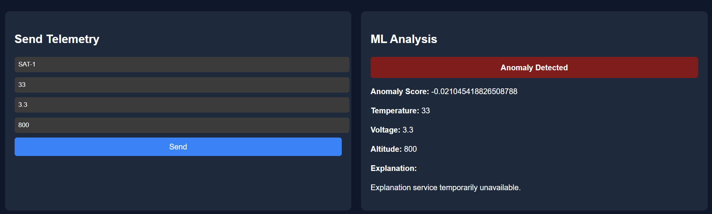
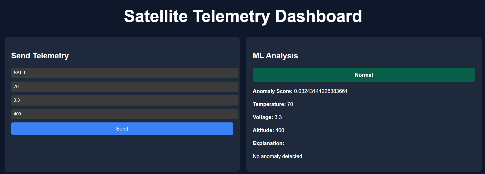
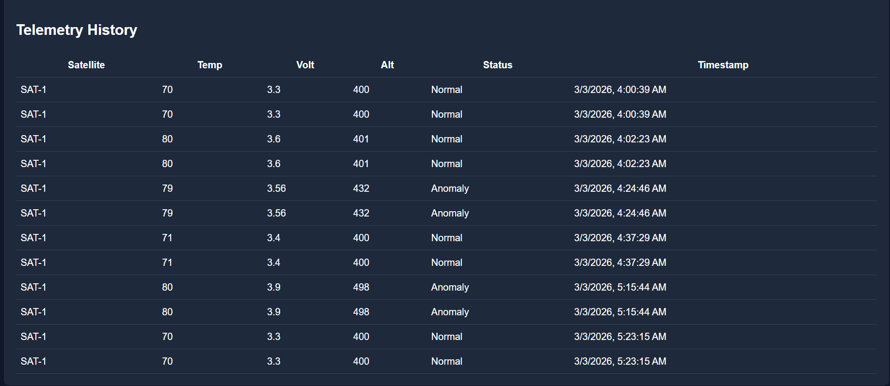

#  Satellite Telemetry Monitoring & Anomaly Detection System


A fully containerized, multi-service telemetry processing platform that ingests satellite data, performs real-time anomaly detection using machine learning, generates contextual explanations, and persists results in a relational database.

Designed to demonstrate microservice architecture, ML integration, distributed systems, and production-style container orchestration.
## Problem Statement

Satellite systems continuously generate telemetry data from multiple sensors such as temperature, voltage, and system status indicators. Detecting anomalies in this data is critical for identifying potential failures, abnormal operating conditions, or unexpected system behavior.

Traditional monitoring approaches rely on manually defined thresholds, which often fail to capture complex patterns in high-volume telemetry streams. This project explores the use of machine learning techniques combined with distributed system architecture to automatically detect anomalies and provide contextual explanations.


## System Architecture
```text
Client (React)
        │
        ▼
Spring Boot Backend  ───── PostgreSQL
        │
        ▼
FastAPI ML Service (IsolationForest + RAG Engine)
```
## System Layers

The system is organised into multiple layers to ensure modularity and scalability.

**1. Presentation Layer**
- React dashboard for telemetry submission and anomaly visualisation
- Displays historical telemetry and anomaly alerts

**2. Application Layer**
- Spring Boot backend providing REST APIs
- Handles request routing, persistence, and WebSocket broadcasting

**3. ML Processing Layer**
- FastAPI microservice responsible for feature engineering and anomaly detection
- Uses a trained IsolationForest model to score incoming telemetry

**4. Data Layer**
- PostgreSQL database storing telemetry records and anomaly results

**5. Infrastructure Layer**
- Docker Compose manages container orchestration, service networking, and environment configuration


## Services

| Service | Tech | Responsibility |
|---------|------|-----------------|
| **Frontend** | React + Vite | Telemetry submission, anomaly visualization, history display |
| **Backend** | Spring Boot | REST API, persistence, WebSocket broadcast |
| **ML Service** | FastAPI + Scikit-Learn | Feature engineering + anomaly scoring |
| **Database** | PostgreSQL | Persistent telemetry storage |
| **Orchestration** | Docker Compose | Multi-service networking & configuration |

##  Key Features

- **Real-time telemetry ingestion** – Accept and process satellite sensor data instantly
- **IsolationForest-based anomaly detection** – Statistically sound anomaly scoring
- **Feature engineering** – Delta and rolling mean computations
- **RAG-powered explanation generation** – Uses FAISS vector search to retrieve contextual documents and generate explanations for detected anomalies
- **REST + WebSocket backend** – Flexible client communication patterns
- **Persistent storage** – PostgreSQL for reliable data retention
- **Fully Dockerized microservice architecture** – Production-ready containerization
- **Environment-based configuration** – Flexible deployment across environments
- **Clean separation of services** – Maintainable, independently deployable components

## Running the Full Stack (Recommended)

From the project root:

```bash
docker compose up --build -d
```

View logs:

```bash
docker compose logs -f
```

### Services & Ports

| Service | URL |
|---------|-----|
| Frontend | http://localhost:5173 |
| Backend | http://localhost:8080 |
| ML Service | http://localhost:8000/docs |
| PostgreSQL | localhost:5432 |

Stop services:

```bash
docker compose down
```

Remove database volume:

```bash
docker compose down -v
```

>  Make sure Docker Desktop is running before executing the commands above.

##  ML Pipeline

The ML service:

- Accepts raw telemetry (/predict)
- Computes engineered features:
  - Temperature delta
  - Voltage delta
  - Rolling mean
- Applies a pre-trained IsolationForest
- Produces:
  - Anomaly score
  - Binary anomaly flag
  - Optional contextual explanation

**Training script:** ml-service/train_model.py

**Generates:** anomaly_pipeline.pkl

*(Note: Model artifacts are excluded from Git.)*

##  Data Flow

1. Client sends telemetry to ML service
2. ML service scores data
3. ML service optionally forwards result to backend
4. Backend stores record in PostgreSQL
5. Backend broadcasts via WebSocket
6. Clients retrieve history via /api/telemetry

## Running Services Individually

### Backend

```bash
cd secure_dashboard
./mvnw clean install
./mvnw spring-boot:run
```


Or with custom database:

```bash
./mvnw spring-boot:run \
    -Dspring.datasource.url=jdbc:postgresql://localhost:5432/telemetry \
    -Dspring.datasource.username=postgres \
    -Dspring.datasource.password=postgres
```

**Tests:** Unit/integration tests use in-memory H2 via `src/test/resources/application.properties`

### ML Service

```bash
cd ml-service
pip install -r requirements.txt
uvicorn app:app --reload --port 8000
```


Expects trained pipeline: `anomaly_pipeline.pkl`

Optionally forwards results to backend at `http://backend:8080/api/ml/result` (adjust `SPRING_URL` in `app.py`)

### Support Scripts

- **`ml-service/train_model.py`** – Synthetic data generator & model training → `anomaly_pipeline.pkl`
- **`ml-service/rag/build_index.py`** – Builds FAISS index & document list for explanation generation

## Testing

Backend tests use in-memory H2:

```
src/test/resources/application.properties
```

## Environment Configuration

Environment variables for:

- Database credentials
- Service URLs
- Optional OpenAI API key (RAG)

Frontend configuration via:

- frontend/.env.production
- frontend/.env.development

## Future Work

Possible improvements and research directions include:

- Evaluating deep learning based anomaly detection methods such as **Autoencoders or LSTM networks**
- Expanding the **RAG explanation system** with larger knowledge bases and improved retrieval strategies
- Integrating **stream processing frameworks (Kafka / Spark Streaming)** for large-scale telemetry ingestion
- Applying the system to **real-world satellite telemetry datasets**
- Implementing **automated alerting systems** for anomaly detection events

## Tech Stack

- **Java 17** – Backend runtime
- **Spring Boot 3** – Web framework & DI
- **PostgreSQL** – Relational database
- **FastAPI** – ML service framework
- **Scikit-Learn** – Machine learning
- **React** – Frontend UI
- **Docker Compose** – Container orchestration

## Screenshots




## Why This Project?

This project demonstrates:

- **Multi-service architecture** – Loosely coupled, independently deployable services
- **Backend + ML integration** – Seamless service-to-service communication
- **Container networking** – Service discovery via Docker DNS
- **Environment-driven configuration** – Flexible, secure credential management
- **Clean production-style structure** – Industry-standard project organization
- **Separation of concerns** – Each service owns its domain
