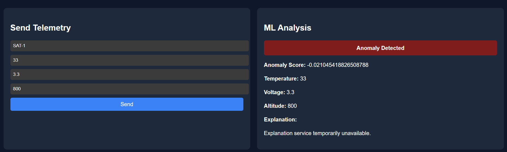
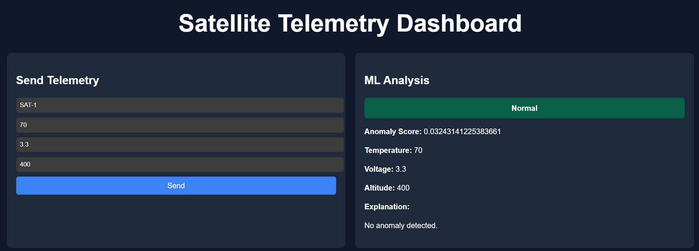
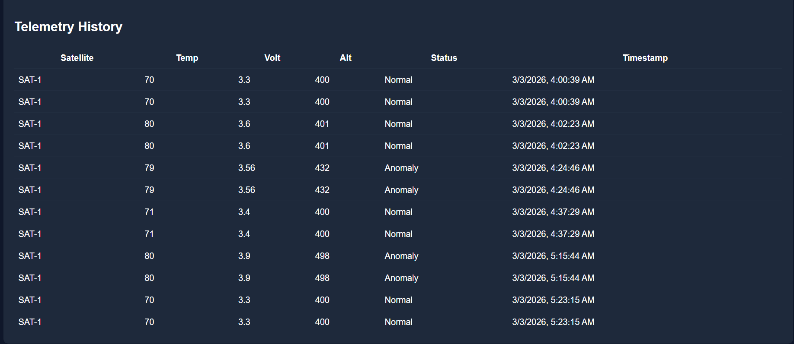

# Satellite Telemetry Monitoring & Anomaly Detection System

[](https://openjdk.org/)
[](https://spring.io/projects/spring-boot)
[](https://fastapi.tiangolo.com/)
[](https://scikit-learn.org/)
[](https://react.dev/)
[](https://www.postgresql.org/)
[](https://docs.docker.com/compose/)

A containerised, multi-service telemetry processing platform that accepts manually submitted telemetry readings, detects anomalies in real time using machine learning, generates contextual explanations via a RAG pipeline, and persists results in PostgreSQL.

---

## Problem Statement

Satellite systems generate telemetry readings such as temperature, voltage, and altitude. This project simulates that data by accepting manually entered readings through a dashboard form, scoring them for anomalies using a trained IsolationForest model, and retrieving the closest matching fault description via a FAISS-backed RAG layer.

---

## System Architecture

Spring Boot acts as the single orchestrator. The frontend sends all telemetry to Spring Boot, which calls FastAPI internally for ML scoring, persists the result to PostgreSQL, and returns the scored result to the frontend. The frontend never talks to FastAPI directly.

```
React Frontend
      │
      │  POST /api/telemetry
      ▼
Spring Boot Backend ── calls internally ──► FastAPI ML Service
      │                                       IsolationForest
      │  saves result                         RAG Engine (FAISS)
      ▼
PostgreSQL DB
      │
      │  returns scored result
      ▼
React Frontend (displays result + refreshes history)
```

**On ML service startup**, FastAPI makes one call to Spring Boot's `/api/telemetry` to load existing telemetry history. This seeds the in-memory state (previous readings, rolling mean) so that anomaly scoring is accurate immediately — even after a restart.

---

## Design Decisions

**Why a separate ML service instead of putting ML inside Spring Boot?**
The ML service is independently deployable. The current IsolationForest model is designed to be replaced with more complex approaches such as Autoencoders or LSTM networks as the project evolves. Retraining the model, swapping the algorithm, or changing the feature engineering only requires changes to the Python service — Spring Boot does not need to be touched or redeployed. The Python ML ecosystem (Scikit-learn, FAISS, sentence-transformers) also has no mature Java equivalent, making Python the natural choice for the ML layer.

**Why Spring Boot as the orchestrator?**
Spring Boot was chosen because it provides a mature ecosystem for persistence (Spring Data JPA maps the `TelemetryData` model to a PostgreSQL table automatically — no SQL was written manually) and is widely used in enterprise environments. Spring Security is included as a dependency with all requests currently permitted — authentication and authorisation can be layered on without restructuring the application.

**Why FastAPI for the ML service?**
FastAPI is lightweight and simple to set up — a single `app.py` file is enough to expose a working prediction endpoint. It also provides a built-in interactive API page at `/docs` which was useful for testing the ML service during development.

**Why PostgreSQL?**
PostgreSQL stores telemetry history so it persists across restarts and page refreshes. Without it, all submitted readings and anomaly results would be lost when the server stops. Spring Data JPA maps the `TelemetryData` model to a table automatically and provides `save()` and `findAll()` out of the box — no SQL was written manually. The data is stored in a Docker volume so it survives container restarts — only `docker compose down -v` removes it permanently.

**Why in-memory state in the ML service?**
The ML service keeps a per-satellite dictionary of previous readings in memory to compute delta features and a rolling mean efficiently on every request. On startup, this dictionary is seeded from PostgreSQL via Spring Boot's API so it is accurate immediately after a restart. During normal operation it is updated with each new reading.

**Why Docker Compose?**
The project spans four different runtimes — Java, Python, Node, and PostgreSQL. Without Docker Compose, each service would need to be installed and started manually with the correct runtime versions and environment variables. Docker Compose reduces the entire setup to one command and ensures services start in the correct order.

**Why IsolationForest?**
IsolationForest is well suited to unsupervised anomaly detection on tabular data. It requires no labelled anomaly examples, handles the feature space efficiently, and produces an interpretable anomaly score rather than just a binary flag — which makes the results easier to explain to an operator.

**Why a RAG layer for explanations?**
A raw anomaly score tells you something is wrong but not why. The RAG layer retrieves the closest matching fault description from a knowledge base, giving the operator actionable context alongside the detection. FAISS keeps the retrieval fast and offline — no external API call is needed for the core explanation.

---

## Services

| Service | Tech | Port | Responsibility |
|---|---|---|---|
| **Frontend** | React + Vite → nginx | 5173 (host) → 80 (container) | Telemetry submission form, anomaly visualisation, history display |
| **Backend** | Spring Boot 3 | 8080 | Orchestrates ML call, persists to DB, history API |
| **ML Service** | FastAPI + Scikit-Learn | 8000 | Feature engineering, anomaly scoring, RAG explanation |
| **Database** | PostgreSQL 15 | 5432 | Persistent telemetry + anomaly storage |

> **Note on the frontend port:** When running via Docker Compose, port `5173` on your host maps to **nginx port 80** inside the container. The frontend is a production build served by nginx — not the Vite dev server.

---

## Quick Start (Docker Compose)

### Prerequisites

- Docker Desktop running
- An `.env` file in the project root (see Environment Configuration below)

### Build the RAG index first

```bash
cd ml-service
pip install -r requirements.txt
python rag/build_index.py
cd ..
```

This generates `ml-service/rag/faiss_index.bin` and `ml-service/rag/documents.pkl`.

### Train the model

```bash
cd ml-service
python train_model.py
cd ..
```

This generates `anomaly_pipeline.pkl` in `ml-service/`.

> Model artifacts are excluded from Git via `.gitignore`. You must generate them locally before building the Docker image.

### Start all services

```bash
docker compose up --build -d
```

View logs:

```bash
docker compose logs -f
```

### Services & URLs

| Service | URL |
|---|---|
| Frontend | http://localhost:5173 |
| Backend API | http://localhost:8080 |
| ML Service (docs) | http://localhost:8000/docs |
| PostgreSQL | localhost:5432 |

Stop services:

```bash
docker compose down
```

Remove database volume:

```bash
docker compose down -v
```

> **Warning:** `docker compose down -v` permanently deletes the PostgreSQL volume and all stored telemetry history.

---

## ML Pipeline

The ML service (`ml-service/app.py`) accepts a `POST /predict` request from Spring Boot and returns a scored result.

**Feature engineering** (computed per satellite, statefully):

| Feature | Description |
|---|---|
| `temperature` | Submitted reading |
| `voltage` | Submitted reading |
| `altitude` | Submitted reading |
| `temp_delta` | Change in temperature since last reading |
| `volt_delta` | Change in voltage since last reading |
| `rolling_temp_mean` | Rolling mean of last 10 temperature readings |

**Model:** IsolationForest (300 estimators, contamination=0.02), trained on normal telemetry only, with a StandardScaler fitted on the full dataset.

**Output:**
- `anomalyScore` — raw decision function score (more negative = more anomalous)
- `isAnomaly` — boolean flag (`true` when `prediction == -1`)
- `explanation` — RAG-retrieved fault description (anomalies only)

**Training script:** `ml-service/train_model.py`
**Output artifact:** `ml-service/anomaly_pipeline.pkl`

---

## RAG Explanation Engine

When an anomaly is detected, `rag/rag_engine.py` generates a contextual explanation in two steps:

1. **Retrieval:** The anomaly data is converted to a text description and embedded using `sentence-transformers/all-MiniLM-L6-v2`. FAISS searches the local index for the 2 most similar fault descriptions from the knowledge base.

2. **Generation:** The retrieved descriptions and anomaly data are sent to OpenAI GPT-4o-mini, which generates a human-readable explanation of the likely cause and recommended action from the perspective of an aerospace systems analyst.

The current knowledge base covers four fault patterns (voltage drop, temperature spike, voltage decay, temperature oscillation). Expanding the document set and rebuilding the index will improve explanation coverage.

> **Requires:** `OPENAI_API_KEY` environment variable. Without it the explanation step is skipped and a fallback message is returned — anomaly detection still works normally.

**Build index:** `ml-service/rag/build_index.py`
**Index artifacts:** `ml-service/rag/faiss_index.bin`, `ml-service/rag/documents.pkl`

---

## Running Services Individually

### Backend (Spring Boot)

```bash
cd secure_dashboard
./mvnw clean install
./mvnw spring-boot:run
```

> **Windows users:** If you get a `FATAL: invalid value for parameter "TimeZone"` error, run:
> ```bash
> ./mvnw spring-boot:run "-Dspring-boot.run.jvmArguments=-Duser.timezone=Asia/Kolkata"
> ```

Backend tests use an in-memory H2 database configured in `src/test/resources/application.properties`.

### ML Service (FastAPI)

```bash
cd ml-service
pip install -r requirements.txt
python rag/build_index.py
python train_model.py
python -m uvicorn app:app --reload --port 8000
```

> **Windows users:** Use `python -m uvicorn` instead of `uvicorn` directly if the command is not recognised.

---

## Environment Configuration

Create a `.env` file in the project root:

```env
# Required for RAG explanation generation (optional — explanations fall back gracefully)
OPENAI_API_KEY=your_key_here
```

Frontend environment files:

`frontend/.env.development`:
```env
VITE_BACKEND_URL=http://localhost:8080
```

`frontend/.env.production`:
```env
VITE_BACKEND_URL=http://localhost:8080
```

---

## Testing

Backend unit and integration tests use an in-memory H2 database:

```bash
cd secure_dashboard
./mvnw test
```

Test configuration: `src/test/resources/application.properties`

---

## Tech Stack

| Layer | Technology |
|---|---|
| Frontend | React, Vite, nginx (Docker) |
| Backend | Java 17, Spring Boot 3 |
| ML Service | Python, FastAPI, Scikit-Learn, sentence-transformers, FAISS |
| Database | PostgreSQL 15 |
| Infrastructure | Docker Compose |

---

## Future Work

- **Deep learning anomaly detection:** Swap IsolationForest for Autoencoders or LSTM networks for richer temporal pattern detection.
- **Real telemetry integration:** Connect to a real satellite data source or simulator instead of manual form input.
- **Expanded RAG knowledge base:** Add more fault descriptions to improve explanation quality and coverage.
- **Stream processing:** Integrate Kafka for high-volume telemetry ingestion at scale.
- **Authentication:** Add JWT authentication using the Spring Security foundation already in place.
- **Real-time updates:** Add Server-Sent Events so the history table updates automatically across multiple connected clients.

---

## Screenshots



